# claude-mascot

A desktop pet for Windows that reacts to what Claude Code is actually doing, and
tells you how much of your Claude usage limit is left.

<p align="center">
  
</p>

It walks along the bottom of your screen, ties on a headband when you send a
prompt, hammers a keyboard while Claude edits files, digs while it runs Bash,
hops and glows when a permission prompt is waiting for you, plants a flag when
the turn is done, and collapses when the 5-hour limit runs out. Its body
doubles as the gauge: the torso drains from the top down as the limit is spent.

Inspired by [Ivel10Go/claude-caelestia-shell](https://github.com/Ivel10Go/claude-caelestia-shell),
which is QML/Quickshell for Linux+Wayland. This is a ground-up Windows build —
none of that code is portable — but the character geometry follows the same
24×24 authoring grid so the two look like the same creature.

## Animations

**[→ The full gallery, all 42 of them](docs/ANIMATIONS.md)**

Every picture in this repository is generated from the rig itself. There are no
drawing assets here: `npm run gen-previews` imports the same `mark.js` the
overlay uses, drives it through a throwaway DOM, and stacks the frames into an
SVG flipbook. Nothing in the docs can show a pose the mascot cannot strike.

|  |  |  |  |
|:--:|:--:|:--:|:--:|
| <br>plants a flag | <br>throws confetti | <br>ties a headband on | <br>floats and sparkles |
| <br>backflip | <br>dance | <br>spin | <br>facepalm |

Animations are procedural pose functions, not keyframe tables: each takes
elapsed time plus a live metrics object and writes onto a neutral pose. That is
what lets a reading drive geometry directly — "drain the torso by however much
of the 5-hour limit is gone" is one expression rather than a hand-authored
timeline per state.

Everything is switchable. The dashboard's **Animations** panel has a checkbox
per Claude Code event, per idle flourish, and per live effect, plus sliders for
size and walking speed. Turning an event off makes the app drop it in the main
process, so the mascot neither moves nor speaks for it.

## Status

Feature-complete: the overlay, the rig and its 42 animations, the hook daemon,
Claude limit and cost readouts, the speech-bubble engine, machine telemetry,
window-edge physics with climbing and throwing, the dashboard, and a packaged
installer.

Known gaps: the overlay is a full-screen transparent layer rather than a small
window per pet (see Notes), and there are no automated tests beyond
`npm run doctor`, which needs a running instance.

## Requirements

- Windows 10/11
- Node.js 18+
- Claude Code 2.1.x (needs `type: "http"` hooks and `rate_limits` in the
  statusLine payload)

## Getting started

```bash
npm install
npm start
```

That gets you the mascot with its own idle behaviour. To make it react to Claude
Code and know your real limits, install the hooks:

```bash
npm run install-hooks
```

This edits `~/.claude/settings.json`. It backs the file up to `~/.claude/backups/`
first, and `npm run uninstall-hooks` restores it byte-for-byte. If you already
have a `statusLine` configured, it is chained rather than replaced — yours still
renders, ours just gets a copy of the payload on the way through.

Check everything end to end:

```bash
npm run doctor
```

## The 5-hour limit, and why it might be blank

This is the one thing worth understanding before anything else.

`npm run install-hooks` installs **two separate things**, and they fail
separately:

| | What it feeds | Where it runs |
|---|---|---|
| **Hooks** | what Claude is doing right now — the reactions | every Claude Code surface |
| **statusLine** | the 5-hour and 7-day limits, context window, session cost | **the terminal only** |

The percentages exist in exactly one place: the payload Claude Code hands to its
status line. There is no API for them, and they are not in the transcripts. The
status line is a terminal-UI feature — **the Claude Code desktop app doesn't
render one**, so in the desktop app the forwarder never runs and no limits ever
arrive.

That produces a very specific symptom: the mascot reacts perfectly to
everything Claude does, and the limit gauges stay empty.

**The fix is to run `claude` in a terminal.** Once. The moment its status line
renders, the numbers appear and stay until they go stale. After that you can go
back to the desktop app; they only refresh while a terminal session is open.

The dashboard tells you which of these you are in rather than making you guess —
it distinguishes *not registered* from *registered but never run* from *runs but
carries no limits* (API-key auth, or a plan without windowed limits) from
*simply stale*. `npm run doctor` reports the same thing.

Token counts and cost estimates come from the transcripts instead, so those keep
working with no terminal session at all.

## How it knows things

| What | Source |
|---|---|
| 5-hour and 7-day limits, context window, session cost | `rate_limits` / `context_window` / `cost` in the Claude Code statusLine payload — the only place the real percentages appear |
| What Claude is doing right now | Claude Code hooks, POSTed to a loopback HTTP daemon on `127.0.0.1:4747` |
| Token history and cost estimates | Tailing `~/.claude/projects/**/*.jsonl` |
| CPU, memory, disk | `os.cpus()` deltas and `fs.statfs` — syscalls, no subprocess |
| Battery | `wmic` once a minute for the percentage (~6× cheaper than PowerShell); charging state comes free from Electron's `powerMonitor` events |
| GPU load and temperature | `nvidia-smi` every 15s, self-disabling if absent |
| Window positions, so it can stand on your title bars | A long-lived PowerShell sidecar that P/Invokes `EnumWindows` and streams JSON lines. Costs ~88MB of RSS — turn it off with the "Walk on window edges" setting |

On a multi-monitor machine the mascot lives on the primary screen only —
one per screen adds up fast. The tray menu and the dashboard let you pick a
different screen, or put one on every screen.

The mascot climbs the screen's own sides to get anywhere. That is not
decoration: on a normal desktop every window floats clear of the taskbar, so
from the floor there is no ledge within jumping range and no window side low
enough to grab. You can also pick it up and throw it.

The daemon binds to loopback only and requires a bearer token generated on first
run, stored in `%APPDATA%/claude-mascot/` — never in this repo.

### On the cost figure

The number from the transcripts is an **equivalent API cost** — what those tokens
would have cost at API rates. On a Pro/Max subscription no money moves per token,
so it is labelled as an estimate everywhere it appears. Claude Code's own
`cost.total_cost_usd` is the authoritative figure for a live session; the
transcript reader fills in history, which the statusLine cannot.

Cache writes are priced separately for the 5-minute and 1-hour TTLs, because the
transcripts distinguish them and the rates differ (1.25× vs 2× the input rate).

## Development

```bash
npm start                  # run the app
npm run dashboard          # run it with the dashboard already open
npm run doctor             # 43 end-to-end checks against a running instance
npm run doctor -- --probe  # also cycle visible reactions so you can watch them
npm run playground         # serve the rig playground on :5180
npm run gen-previews       # rebuild docs/anims and docs/ANIMATIONS.md
npm run build              # installer + portable exe into dist/
```

`npm run build` regenerates `build/icon.ico` from the same geometry as the rig
and the tray icon, so the installer, the executable and the on-screen mascot
cannot drift apart.

The playground renders every animation at once with live sliders for the
metric-driven modifiers. It is the fastest way to tune the rig.

### How the rig works

- `src/renderer/overlay/rig/mark.js` — the character, built only from rects
- `src/renderer/overlay/rig/anims.js` — animations, plus the metric modifiers
- `src/renderer/overlay/rig/player.js` — crossfading between them
- `src/shared/catalog.js` — the single list of animations, reactions and effects
- `src/shared/rules.js` — what the mascot is allowed to say, and when

`catalog.js` is what the settings UI, the preview gallery and the doctor are all
built from. An animation that is missing from it can never be switched off and
never gets a picture, so `npm run doctor` fails on a gap rather than letting one
quietly appear.

Props — the headband, the flag, the confetti, the sparkles — are extra geometry
in `mark.js` driven by a `props` block on the pose. A prop group at zero is
`display: none`, so a mascot that never celebrates costs nothing for the
confetti it isn't throwing.

## Notes

- Idle cost is around 1% of a 20-core machine — of which roughly half is the
  GPU process compositing a full-screen transparent layer, and the rest splits
  between the rig's 24 fps loop and the telemetry collectors. Treat that as an
  order of magnitude, not a figure: on a busy machine repeated measurements of
  the *same* build span 14–24% of one core, which is far wider than the
  difference between any two versions of this app. A per-pet window instead of
  a full-screen layer is the real fix and is not done yet.
- No native modules. `koffi` was evaluated for the Win32 battery and window
  APIs and rejected: it ships no prebuilt binary, so it needs an install-time
  build step that many npm setups block outright.
- Everything is drawn from geometry at runtime, including the tray icon.
- The gallery's SVGs animate with CSS. If a viewer strips it, each one falls
  back to a correct still frame rather than a blank or a pile — frame 0 carries
  a plain `opacity="1"` attribute for exactly that case.

## Licence

MIT
