# Animations

Every animation the mascot has, rendered straight out of the rig. There are no
drawing assets in this repository — each picture below is the real
`mark.js` geometry sampled at 12 points and stacked into an SVG
flipbook by `npm run gen-previews`, so nothing here can show a pose the
mascot cannot actually strike.

Each one can be switched off individually in the dashboard under
**Animations**.

## Ambient

<table>
<tr><td align="center" width="25%"> <b>Idling</b> <code>idle</code></td><td align="center" width="25%"> <b>Blink</b> <code>blink</code></td><td align="center" width="25%"> <b>Look up</b> <code>lookUp</code></td><td align="center" width="25%"> <b>Scan</b> <code>scan</code></td></tr>
<tr><td align="center" width="25%"> <b>Think</b> <code>think</code></td></tr>
</table>

## Locomotion

<table>
<tr><td align="center" width="25%"> <b>Walk</b> <code>walk</code></td><td align="center" width="25%"> <b>Run</b> <code>run</code></td><td align="center" width="25%"> <b>Turn</b> <code>turn</code></td></tr>
</table>

## Flourishes

<table>
<tr><td align="center" width="25%"> <b>Wave</b> <code>wave</code></td><td align="center" width="25%"> <b>Celebrate</b> <code>celebrate</code></td><td align="center" width="25%"> <b>Backflip</b> <code>backflip</code></td><td align="center" width="25%"> <b>Dance</b> <code>dance</code></td></tr>
<tr><td align="center" width="25%"> <b>Spin</b> <code>spin</code></td><td align="center" width="25%"> <b>Stretch</b> <code>stretch</code></td><td align="center" width="25%"> <b>Shrug</b> <code>shrug</code></td><td align="center" width="25%"> <b>Nod</b> <code>nod</code></td></tr>
<tr><td align="center" width="25%"> <b>Salute</b> <code>salute</code></td><td align="center" width="25%"> <b>Bow</b> <code>bow</code></td><td align="center" width="25%"> <b>Peek</b> <code>peek</code></td><td align="center" width="25%"> <b>Roll</b> <code>roll</code></td></tr>
</table>

## With a prop

<table>
<tr><td align="center" width="25%"> <b>Plant the flag</b> <code>victory</code></td><td align="center" width="25%"> <b>Confetti</b> <code>confetti</code></td><td align="center" width="25%"> <b>Tie the headband</b> <code>headband</code></td><td align="center" width="25%"> <b>Meditate</b> <code>meditate</code></td></tr>
</table>

## Work

<table>
<tr><td align="center" width="25%"> <b>Typing</b> <code>typing</code></td><td align="center" width="25%"> <b>Digging</b> <code>digging</code></td><td align="center" width="25%"> <b>Searching</b> <code>searching</code></td><td align="center" width="25%"> <b>Broadcasting</b> <code>broadcasting</code></td></tr>
<tr><td align="center" width="25%"> <b>Clone</b> <code>clone</code></td></tr>
</table>

## Reactions

<table>
<tr><td align="center" width="25%"> <b>Alert</b> <code>alert</code></td><td align="center" width="25%"> <b>Limit hit</b> <code>limitHit</code></td><td align="center" width="25%"> <b>Stumble</b> <code>stumble</code></td><td align="center" width="25%"> <b>Facepalm</b> <code>facepalm</code></td></tr>
<tr><td align="center" width="25%"> <b>Curl up</b> <code>curl</code></td></tr>
</table>

## Rest

<table>
<tr><td align="center" width="25%"> <b>Sleep</b> <code>sleep</code></td><td align="center" width="25%"> <b>Lie down</b> <code>layDown</code></td><td align="center" width="25%"> <b>Dangle</b> <code>dangle</code></td></tr>
</table>

## Physics

<table>
<tr><td align="center" width="25%"> <b>Leap</b> <code>leap</code></td><td align="center" width="25%"> <b>Fall</b> <code>fall</code></td><td align="center" width="25%"> <b>Land</b> <code>land</code></td><td align="center" width="25%"> <b>Climb</b> <code>climb</code></td></tr>
<tr><td align="center" width="25%"> <b>Carried</b> <code>drag</code></td></tr>
</table>

## What triggers what

Reactions come from Claude Code hooks. Turning one off in the settings makes
the app drop that event entirely — the mascot neither moves nor speaks for it.

| Event | Setting key | Animation |
|---|---|---|
| Session starts | `session.start` | [`stretch`](anims/stretch.svg) |
| You send a prompt | `prompt.submit` | [`headband`](anims/headband.svg) |
| Claude edits files | `tool.typing` | [`typing`](anims/typing.svg) |
| Claude runs Bash | `tool.digging` | [`digging`](anims/digging.svg) |
| Claude reads or searches | `tool.searching` | [`searching`](anims/searching.svg) |
| Claude hits the web | `tool.broadcasting` | [`broadcasting`](anims/broadcasting.svg) |
| Any other tool | `tool.other` | [`think`](anims/think.svg) |
| Subagent starts | `subagent.start` | [`clone`](anims/clone.svg) |
| Permission needed | `permission` | [`alert`](anims/alert.svg) |
| Other notification | `notification` | [`scan`](anims/scan.svg) |
| A tool fails | `tool.failed` | [`facepalm`](anims/facepalm.svg) |
| Context is compacted | `compact` | [`meditate`](anims/meditate.svg) |
| Claude finishes | `turn.done` | [`victory`](anims/victory.svg) |
| A turn fails | `turn.failed` | [`stumble`](anims/stumble.svg) |
| 5-hour limit hit | `limit.hit` | [`limitHit`](anims/limitHit.svg) |
| Session ends | `session.end` | [`sleep`](anims/sleep.svg) |

The flourishes are the mascot's own idea; it works them into its idle rotation
on its own. The physics states are chosen by gravity and by you — pick it up
and throw it.

## Live effects

These are not animations. They are applied on top of whatever is playing, and
are driven by live readings rather than by events.

| Effect | Driven by |
|---|---|
| `tokenDrain` | Body drains with the 5-hour limit |
| `thermal` | Sweats under CPU load |
| `lowBattery` | Droops on low battery |
| `charging` | Pulses while charging |
| `contextFull` | Bloats as the context fills |

---

The character on this page is Anthropic's mascot, and this is an unaffiliated
fan project — not endorsed by, sponsored by, or connected with Anthropic. See
[TRADEMARKS.md](../TRADEMARKS.md) for what the MIT licence does not cover.
